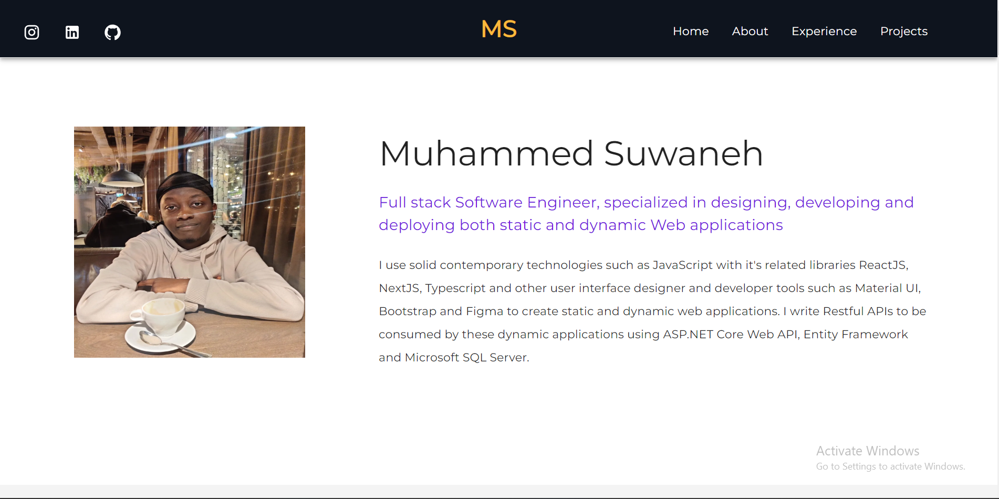

## Portfolio Website

## About Project

This is a static Portfolio website developed using ReactJS+MaterialUI. The site 
gives some general info about me, my experience as a Software Engineer and the projects I worked on.
[explore site](https://muhammedsuwaneh-ce135.firebaseapp.com/)

## Prerequisites

The project runs using npm packages. To run the project follow the instructions below

## Install Node packages

You need NodeJS to run the command below. [Download NodeJS](https://nodejs.org/en/)

```bash
npm install 
```

## Run project

```bash
npm start
```
            
## Technologies utilised

<div id="badges">
  
  
  
  
  
  
  
</div>

## UI Screenshots

### Hero




## License 

This project is licensed under [`MIT`](LICENSE)

## Version 
1.0.0
